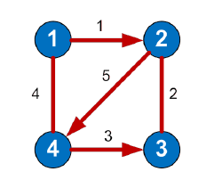

# GraphDataStorage
Console App for converting and storing graph data

# Supported Graph Data Types
There are four main four graph representation methods supported by the application:
- Adjacency matrix
- Incidence matrix
- Adjacency list
- List of arcs

# Features
- Graph input from console or file.
- Graph output to console or file.
- Counting the number of arcs/edges, vertices degree, indegree and outdegree.

# Input format
For this graph



The correct input format would be:
- Adjacency matrix: 
```
4
0 1 0 1
0 0 1 1
0 1 0 0
1 0 1 0
```
Where 4 is the number of vertices;

1 located at row 'i' and column 'j'
indicates that there is an arc going from vertex i to vertex j.
- Incidence matrix:
```
4 5
1 0 0 1 0
-1 1 0 0 1
0 1 -1 0 0
0 0 1 1 -1
```
Where 4 is the number of vertices, 5 is the number of edges/arcs;

1 located at row 'i' and column 'j'
indicates that there is an arc going from vertex i to vertex j;

-1 located at row 'i' and column 'j'
indicates that there is an arc going from vertex j to vertex i.
- Adjacency list:
```
4
2 4 0 3 4 0 2 0 1 3 0
```
Where 4 is the number of vertices;

2 4 indicates that there is an arc going from vertex 1 to vertices 2 and 4; 

0 indicates the end of an input for that vertex.
- List of arcs:
```
7
1 2
1 4
2 3
2 4
3 2
4 1
4 3
```
Where 7 is the number of arcs;

1 and 2 indicates an arc going from vertex 1 to vertex 2.
